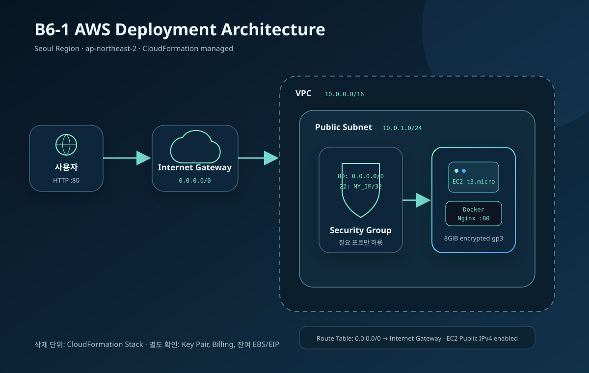

# B6-1: 내가 만든 웹사이트를 인터넷에 올려 누구나 쓰게 하기

AWS 서울 리전의 VPC와 EC2에 **Docker Nginx 정적 사이트**를 배포하는 학습 프로젝트다. CloudFormation으로 인프라를 다시 만들 수 있고, 브라우저와 `/health` 응답으로 실제 동작을 검증한다.

> **현재 상태:** 로컬 구현과 인프라 코드 작성 완료 · AWS 계정이 없어 실제 배포/URL/증거는 대기 중<br>
> 확인하지 않은 AWS 실행 결과를 성공으로 표시하지 않는다.

## 과제 정보

| 항목 | 내용 |
|---|---|
| 분야 | AI/SW 기초 |
| 구분 | 클라우드와 AI API |
| 공식 학습 시간 | 40시간 |
| 필수 여부 | 필수 |
| 과제 번호 | 185015 |
| 리전 | 서울 `ap-northeast-2` |
| 웹 서버 | Docker + Nginx |
| 인프라 | AWS CloudFormation |

## 구현 상태

| 요구사항 | 구현 | 실제 AWS 검증 |
|---|---:|---:|
| 정적 웹사이트 | 완료 | 대기 |
| `GET /health` → 200 `OK` | 완료 | 대기 |
| Dockerfile과 container healthcheck | 완료 | Docker 환경 검사 대기 |
| VPC `10.0.0.0/16` | CloudFormation 완료 | 대기 |
| Public Subnet `10.0.1.0/24` | CloudFormation 완료 | 대기 |
| Internet Gateway와 기본 Route | CloudFormation 완료 | 대기 |
| EC2 t3.micro, 8GiB 암호화 gp3 | CloudFormation 완료 | 대기 |
| HTTP 80 전체 공개 | CloudFormation 완료 | 대기 |
| SSH 22 개인 IP `/32` | CloudFormation 완료 | 대기 |
| SSH `0.0.0.0/0` 거부 | CloudFormation Rule 완료 | 대기 |
| IAM 최소권한 정책 | 완료 | 계정 생성 후 적용 대기 |
| 아키텍처 다이어그램 | 완료 | 해당 없음 |
| 트러블슈팅 기록 | 개발환경 1건 | 실제 AWS 사례 추가 필요 |
| 리소스 정리 체크리스트 | 완료 | 실제 삭제 증거 대기 |
| HTTPS 보너스 | 도메인 없음 | 후속 작업 |

## 아키텍처



요청 흐름:

```text
사용자
 → Internet Gateway
 → Public Subnet Route Table
 → Security Group (HTTP 80)
 → EC2 Public IPv4
 → Docker container
 → Nginx
 → index.html 또는 /health
```

CloudFormation 리소스:

- VPC 1개
- Public Subnet 1개
- Internet Gateway 1개
- Route Table과 `0.0.0.0/0` Route
- Security Group 1개
- EC2 1대
- EC2 종료 시 함께 삭제되는 암호화 EBS 8GiB

Elastic IP, NAT Gateway, Load Balancer, RDS는 만들지 않는다.

## 저장소 구조

```text
.
├── Dockerfile
├── nginx/default.conf
├── site/
│   ├── index.html
│   ├── styles.css
│   └── app.js
├── infra/
│   ├── cloudformation.yml
│   └── deployer-policy.json
├── scripts/
│   ├── test-local.sh
│   ├── deploy-stack.sh
│   ├── delete-stack.sh
│   ├── scan-secrets.sh
│   ├── aws-verify.sh
│   └── validate_project.py
├── docs/
│   ├── architecture.svg
│   ├── account-setup.md
│   ├── deployment-guide.md
│   ├── troubleshooting.md
│   ├── cleanup-checklist.md
│   └── https-plan.md
└── evidence/
    └── README.md
```

## 1. 로컬 Docker 실행

필요한 것:

- Docker Desktop 또는 Docker Engine
- `curl`

```bash
scripts/test-local.sh
```

직접 실행하려면:

```bash
docker build -t b6-1-web .
docker run --rm -p 8080:80 --name b6-1-web b6-1-web
```

다른 터미널:

```bash
curl -i http://localhost:8080/health
```

기대 결과:

```text
HTTP/1.1 200 OK

OK
```

## 2. AWS 배포 순서

현재 AWS 계정이 없으므로 다음 단계를 먼저 수행한다.

1. [`docs/account-setup.md`](docs/account-setup.md): 계정, MFA, IAM, 예산, Key Pair
2. [`docs/deployment-guide.md`](docs/deployment-guide.md): CloudFormation 생성과 검증
3. [`evidence/README.md`](evidence/README.md): 실제 증거 수집
4. [`docs/cleanup-checklist.md`](docs/cleanup-checklist.md): Stack 삭제와 Billing 확인

CloudFormation 콘솔에서 사용할 파일:

```text
infra/cloudformation.yml
```

AWS CloudShell을 선택적으로 사용한다면:

```bash
scripts/deploy-stack.sh b6-1-key 내공인IP/32
scripts/aws-verify.sh b6-1-learning
scripts/delete-stack.sh
```

위 스크립트는 생성·삭제 전 확인 단어를 요구한다. Access Key를 파일에 저장할 필요가 없다.

## 3. 보안 선택

- 루트 계정은 최초 IAM 준비 외에 사용하지 않는다.
- AdministratorAccess를 사용하지 않는다.
- `infra/deployer-policy.json`은 필요한 CloudFormation·EC2 Action과 서울 리전으로 범위를 줄인다.
- HTTP 80만 전체 인터넷에 공개한다.
- SSH 22는 사용자가 입력한 개인 공인 IP `/32`만 허용한다.
- EC2 Metadata는 IMDSv2를 필수로 한다.
- EBS는 암호화하고 EC2 종료 시 삭제한다.
- `.pem`, `.key`, `.env`, `.aws/`는 Git에서 제외한다.
- `scripts/scan-secrets.sh`로 기본 비밀정보 패턴을 검사한다.

## 4. 비용 관리

2025년 7월 15일 이후 신규 계정의 AWS Free Tier는 예전 신규 계정 설명과 다를 수 있다. 2026년 가입자는 계정에서 Free Plan, 크레딧, 6개월 제한, 서비스별 사용 가능 여부를 직접 확인한다.

- https://aws.amazon.com/free/free-tier-faqs/
- https://docs.aws.amazon.com/AWSEC2/latest/UserGuide/ec2-free-tier-usage.html

이 저장소는 리소스를 작게 제한하지만 **비용 0원을 보장하지 않는다.** 증거 수집 후 Stack을 삭제하고 Billing을 확인한다.

## 5. 보너스 범위

### Docker

구현됨:

- Nginx Docker image
- 포트 `80:80`
- Docker healthcheck
- EC2 재부팅 후 자동 시작을 위한 `--restart unless-stopped`

실제 AWS Docker 증거는 배포 후 추가한다.

### HTTPS

현재 사용할 도메인이 없으므로 미구현이다. 거짓 인증서나 localhost 결과로 완료 처리하지 않는다. 후속 계획은 [`docs/https-plan.md`](docs/https-plan.md)에 기록했다.

## 6. 학습과 문제 기록

- [`LEARNING.md`](LEARNING.md): 용어와 단계별 학습
- [`docs/decisions/001-deployment-approach.md`](docs/decisions/001-deployment-approach.md): 선택지와 트레이드오프
- [`docs/mentoring/session-001.md`](docs/mentoring/session-001.md): 학습 멘토 토론
- [`docs/development-log.md`](docs/development-log.md): 순차 구현 기록
- [`docs/issues/`](docs/issues/): 문제와 차단사항
- [`docs/troubleshooting.md`](docs/troubleshooting.md): 재현·가설·검증·조치

## 제출 전 완료 조건

- [ ] AWS 계정과 별도 IAM 사용자
- [ ] 로컬 Docker 실제 검사 PASS
- [ ] CloudFormation `CREATE_COMPLETE`
- [ ] 배포 URL에서 사이트 표시
- [ ] 외부 `/health` 200
- [ ] EC2 내부 Docker `healthy`
- [ ] 실제 AWS 트러블슈팅 1건
- [ ] 증거 이미지 12종
- [ ] Stack과 별도 리소스 삭제
- [ ] Billing 확인
- [ ] 외부 동료평가

이 체크가 끝나기 전까지 Codyssey 제출 상태를 “완료”라고 기록하지 않는다.
