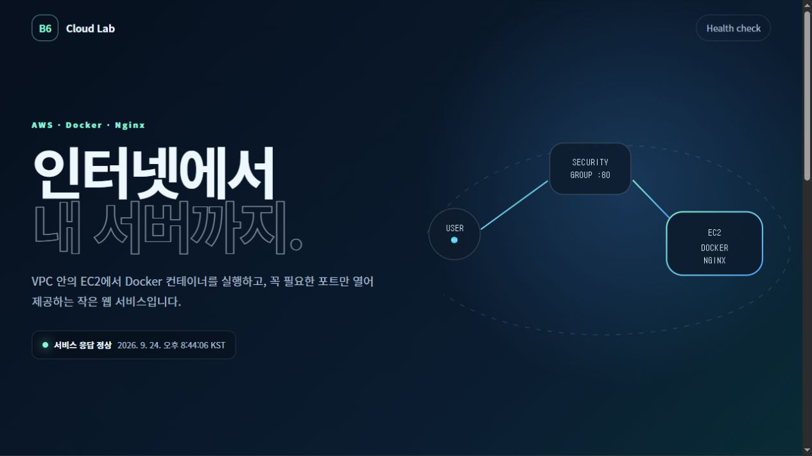

# B6-1: 내가 만든 웹사이트를 인터넷에 올려 누구나 쓰게 하기

> **2026-09-24 권한 변경:** 기존의 서울 전체 EC2 변경 정책은 사용하지 않는다. [배포 권한 경계](docs/deployment-permissions.md)를 먼저 확인하고, 두 정책을 검증·적용한 뒤 진행한다. AWS 적용·실제 배포 검증 전에는 완료로 표시하지 않는다.

AWS 서울 리전의 VPC와 EC2에 **Docker Nginx 정적 사이트**를 배포하는 학습 프로젝트다. CloudFormation으로 인프라를 다시 만들 수 있고, 브라우저와 `/health` 응답으로 실제 동작을 검증한다.

> **현재 상태 (2026-09-24 20:48 KST):** 배포·외부 접속·SSH·Docker healthy·EC2 내부 localhost 200·아웃바운드 200 증거를 수집한 뒤, 사용자 요청으로 스택과 실습 키페어를 삭제했다. 스크린샷 17장은 [증거 목록](evidence/README.md)에 보관한다. 현재 서비스는 운영 중이 아니다.

> **최종 확인 (2026-09-25 07:11 KST):** IAM 사용자 `b6-1-learner`로 콘솔·CloudShell을 사용해 배포·검증·정리를 완료하고, 스택 삭제 및 EC2/EBS·프로젝트 네트워크 잔여 0개를 확인했다. [최종 점검 결과](evidence/final-audit-2026-09-25.md)에 확인 범위와 권한 부족 항목을 기록했다. Billing 최종 집계는 남아 있다.

## 과제 정보

| 항목 | 내용 |
|---|---|
| 분야 | AI/SW 기초 |
| 구분 | 클라우드와 AI API |
| 공식 학습 시간 | 40시간 |
| 필수 여부 | 필수 |
| 과제 번호 | 185015 |
| 리전 | 서울 `ap-northeast-2` |
| 웹 서버 | Docker + Nginx |
| 인프라 | AWS CloudFormation |

## 구현 상태

| 요구사항 | 구현 | 실제 AWS 검증 |
|---|---:|---:|
| 정적 웹사이트 | 완료 | 외부 HTTP 200 확인 |
| `GET /health` → 200 `OK` | 완료 | 외부 HTTP 200/OK 확인 |
| Dockerfile과 container healthcheck | 완료 | CloudFormation 내부 ResourceSignal 통과 |
| VPC `10.0.0.0/16` | CloudFormation 완료 | 실제 VPC 확인 |
| Public Subnet `10.0.1.0/24` | CloudFormation 완료 | 실제 Subnet 확인 |
| Internet Gateway와 기본 Route | CloudFormation 완료 | `0.0.0.0/0 → IGW` 확인 |
| EC2 t3.micro, 8GiB 암호화 gp3 | CloudFormation 완료 | EC2 running 확인 |
| HTTP 80 전체 공개 | CloudFormation 완료 | 보안 그룹 확인 |
| SSH 22 개인 IP `/32` | CloudFormation 완료 | `[SSH_SOURCE_IP]/32` 확인 |
| SSH `0.0.0.0/0` 거부 | CloudFormation Rule 완료 | 공개 SSH 규칙 없음 확인 |
| IAM 최소권한 정책 | 완료 | 제한 정책 2개 연결 및 시뮬레이션 확인 |
| 아키텍처 다이어그램 | 완료 | SVG 원본 + 제출용 PDF |
| 트러블슈팅 기록 | AWS 사례 1건 | 정책 오류 해결 기록 |
| 리소스 정리 체크리스트 | 완료 | DELETE_COMPLETE 및 잔여 0 확인 |
| HTTPS 보너스 | 도메인 없음 | 후속 작업 |

## 아키텍처


제출용 파일: [docs/architecture.pdf](docs/architecture.pdf) (과제 최소 규격)

요청 흐름:

```text
사용자
 → Internet Gateway
 → Public Subnet Route Table
 → Security Group (HTTP 80)
 → EC2 Public IPv4
 → Docker container
 → Nginx
 → index.html 또는 /health
```

CloudFormation 리소스:

- VPC 1개
- Public Subnet 1개
- Internet Gateway 1개
- Route Table과 `0.0.0.0/0` Route
- Security Group 1개
- EC2 1대
- EC2 종료 시 함께 삭제되는 암호화 EBS 8GiB

Elastic IP, NAT Gateway, Load Balancer, RDS는 만들지 않는다.

## 저장소 구조

```text
.
├── Dockerfile
├── nginx/default.conf
├── site/
│   ├── index.html
│   ├── styles.css
│   └── app.js
├── infra/
│   ├── cloudformation.yml
│   └── deployer-policy.json
├── scripts/
│   ├── test-local.sh
│   ├── deploy-stack.sh
│   ├── delete-stack.sh
│   ├── scan-secrets.sh
│   ├── aws-verify.sh
│   └── validate_project.py
├── docs/
│   ├── architecture.svg
│   ├── architecture.pdf
│   ├── account-setup.md
│   ├── deployment-guide.md
│   ├── troubleshooting.md
│   ├── cleanup-checklist.md
│   └── https-plan.md
└── evidence/
    └── README.md
```

## 1. 로컬 Docker 실행

필요한 것:

- Docker Desktop 또는 Docker Engine
- `curl`

```bash
scripts/test-local.sh
```

직접 실행하려면:

```bash
docker build -t b6-1-web .
docker run --rm -p 8080:80 --name b6-1-web b6-1-web
```

다른 터미널:

```bash
curl -i http://localhost:8080/health
```

기대 결과:

```text
HTTP/1.1 200 OK

OK
```

## 2. AWS 배포 순서

기존 AWS 계정은 사용할 수 있지만 보안·비용 준비 상태는 아직 확인하지 않았다. 계정 소유자가 Console에서 다음 단계를 순서대로 수행한다.

1. [`docs/account-setup.md`](docs/account-setup.md): 계정, MFA, IAM, 예산, Key Pair
2. [`docs/deployment-guide.md`](docs/deployment-guide.md): CloudFormation 생성과 검증
3. [`evidence/README.md`](evidence/README.md): 실제 증거 수집
4. [`docs/cleanup-checklist.md`](docs/cleanup-checklist.md): Stack 삭제와 Billing 확인

CloudFormation 콘솔에서 사용할 파일:

```text
infra/cloudformation.yml
```

이번 실행은 Console에서 Stack을 만들고, 같은 로그인 세션의 AWS CloudShell에서 검증한다.

```bash
git clone https://github.com/giyeop-cody/B6-1.git
cd B6-1
scripts/aws-verify.sh b6-1-learning
```

장기 Access Key를 만들거나 파일에 저장하지 않는다. CLI 생성·삭제를 선택할 경우에만 `scripts/deploy-stack.sh`와 `scripts/delete-stack.sh`를 사용하며 두 스크립트는 확인 단어를 요구한다.

## 3. 보안 선택

- 루트 계정은 최초 IAM 준비 외에 사용하지 않는다.
- AdministratorAccess를 사용하지 않는다.
- `infra/deployer-policy.json`은 필요한 CloudFormation·EC2·SSM·CloudShell Action과 서울 리전으로 범위를 줄인다.
- CloudShell 파일 upload/download 권한은 주지 않는다.
- HTTP 80만 전체 인터넷에 공개한다.
- SSH 22는 사용자가 입력한 개인 공인 IP `/32`만 허용한다.
- EC2 Metadata는 IMDSv2를 필수로 한다.
- EBS는 암호화하고 EC2 종료 시 삭제한다.
- `.pem`, `.key`, `.env`, `.aws/`는 Git에서 제외한다.
- `scripts/scan-secrets.sh`로 기본 비밀정보 패턴을 검사한다.

## 4. 비용 관리

2025년 7월 15일 이후 신규 계정의 AWS Free Tier는 예전 신규 계정 설명과 다를 수 있다. 2026년 가입자는 계정에서 Free Plan, 크레딧, 6개월 제한, 서비스별 사용 가능 여부를 직접 확인한다.

- https://aws.amazon.com/free/free-tier-faqs/
- https://docs.aws.amazon.com/AWSEC2/latest/UserGuide/ec2-free-tier-usage.html

이 저장소는 리소스를 작게 제한하지만 **비용 0원을 보장하지 않는다.** 증거 수집 후 Stack을 삭제하고 Billing을 확인한다.

## 5. 보너스 범위

### Docker

구현됨:

- Nginx Docker image
- 포트 `80:80`
- Docker healthcheck
- EC2 재부팅 후 자동 시작을 위한 `--restart unless-stopped`

실행 이미지 `b6-1-web:latest`, 컨테이너 `b6-1-web`, 포트 `80:80`. 실제 SSH의 Docker healthy, localhost 200은 [08 증거](evidence/08-docker-healthy.jpg), 외부 접속은 [06 증거](evidence/06-browser-home.jpg)에 보관했다. 검증 후 컨테이너와 EC2를 정리했다.

### HTTPS

현재 사용할 도메인이 없으므로 미구현이다. 거짓 인증서나 localhost 결과로 완료 처리하지 않는다. 후속 계획은 [`docs/https-plan.md`](docs/https-plan.md)에 기록했다.

## 6. 학습과 문제 기록

- [`LEARNING.md`](LEARNING.md): 용어와 단계별 학습
- [`docs/decisions/001-deployment-approach.md`](docs/decisions/001-deployment-approach.md): 배포 방식 선택
- [`docs/decisions/002-console-cloudshell-auth.md`](docs/decisions/002-console-cloudshell-auth.md): 비밀 키 없는 인증·검증 방식 선택
- [`docs/mentoring/session-001.md`](docs/mentoring/session-001.md): 학습 멘토 토론
- [`docs/development-log.md`](docs/development-log.md): 순차 구현 기록
- [`docs/issues/`](docs/issues/): 문제와 차단사항
- [`docs/troubleshooting.md`](docs/troubleshooting.md): 재현·가설·검증·조치

## 제출 전 완료 조건

- [x] 루트 MFA와 실습 IAM 사용자 생성 확인 (IAM 사용자 MFA·정책 최소화는 후속)
- [ ] 로컬 Docker 실제 검사 PASS
- [x] CloudFormation `CREATE_COMPLETE`
- [x] 배포 URL에서 사이트 표시
- [x] 외부 `/health` 200
- [x] CloudFormation ResourceSignal로 EC2 내부 헬스체크 통과
- [x] 실제 AWS 트러블슈팅 1건
- [x] 필수 외부 접속 증거 1장: `evidence/06-browser-home.jpg` (방식 A)
- [x] Docker 보너스: `docker ps` healthy 및 EC2 내부 localhost 200 검증
- [x] IAM 사용자 콘솔·CloudShell 접근 및 서울 EC2 조회 증거 (`evidence/iam-session-2026-09-25.md`)
- [x] IAM 사용자 세션에서 배포·검증·정리 완료
- [x] SSH 실제 접속 및 EC2 아웃바운드 HTTP 200 검증
- [x] 추가 학습용 증거 포함 17장 저장 (과제 필수 수량과 구분)
- [x] Stack 및 실습 키페어 삭제 / 잔여 리소스 조회
- [x] Billing/Bills/Credits 화면 확인 및 저장
- [ ] 집계 반영 후 최종 사용 내역 확인 (2026-09-25 20:48 KST 이후)

## 실제 배포 결과 (2026-09-24, 삭제 전 기록)

과제 제출 방식은 **A(브라우저 접속)** 이다. `/health`는 추가 검증이다.



CloudShell에서 서울 리전 `ap-northeast-2`의 `b6-1-learning` CloudFormation 스택을 생성했다. 최초 스택은 `CREATE_COMPLETE`, 이후 템플릿 업데이트는 `UPDATE_COMPLETE`이며 EC2 UserData의 내부 `/health` 검사가 SUCCESS 신호를 보낸 뒤 완료됐다.

- 삭제 전 사이트: `http://13.125.21.155` (삭제 후 접속 대상 아님)
- 삭제 전 Health: `http://13.125.21.155/health` → 외부 `HTTP 200`, 본문 `OK`
- EC2: `i-093226b9e4314ad26`, `t3.micro`, `running`
- VPC/Subnet: `vpc-049d1e236397b35ce` / `subnet-0e7b633d4b9df52f1`
- 보안 그룹: HTTP 80 공개, SSH 22는 배포 당시 `[SSH_SOURCE_IP]/32`만 허용
- 라우팅: `0.0.0.0/0 → igw-00b2cc0a2030904bb`
- 아웃바운드: 20:45 KST 실제 SSH 세션에서 `https://example.com` HTTP 200을 확인했다.
- SSH: EC2 Instance Connect로 일회성 공개 키를 주입하고 `ec2-user` 접속에 성공했다. 임시 CloudShell /32 규칙은 검증 직후 제거했으며, 삭제 전 원래 SSH /32 규칙만 남은 것을 확인했다.

세부 원본은 [evidence/aws-verification.txt](evidence/aws-verification.txt)에 기록했다. `b6-1-learner` IAM 사용자로 CloudShell 배포·검증을 수행했으며, `B61DeployerPolicyRestricted`, `B61Ec2DeploymentPolicy`, `IAMUserChangePassword`만 연결하고 기존 광범위 `B61DeployerPolicy`는 분리했다.

이 체크가 끝나기 전까지 Codyssey 제출 상태를 “완료”라고 기록하지 않는다.

## 공개 저장소의 계정 값

정책 JSON과 기록의 `000000000000`은 계정 ID 대체값이다. 정책을 실제 적용하기 전에 본인 AWS 계정 ID로 바꾼다. `[SSH_SOURCE_IP]` 역시 비공개 처리한 기록용 표식이다. 기존 스크린샷 17장과 IAM 증거 1장의 공개용 사본을 제공하며 원본은 로컬에 보존한다.
