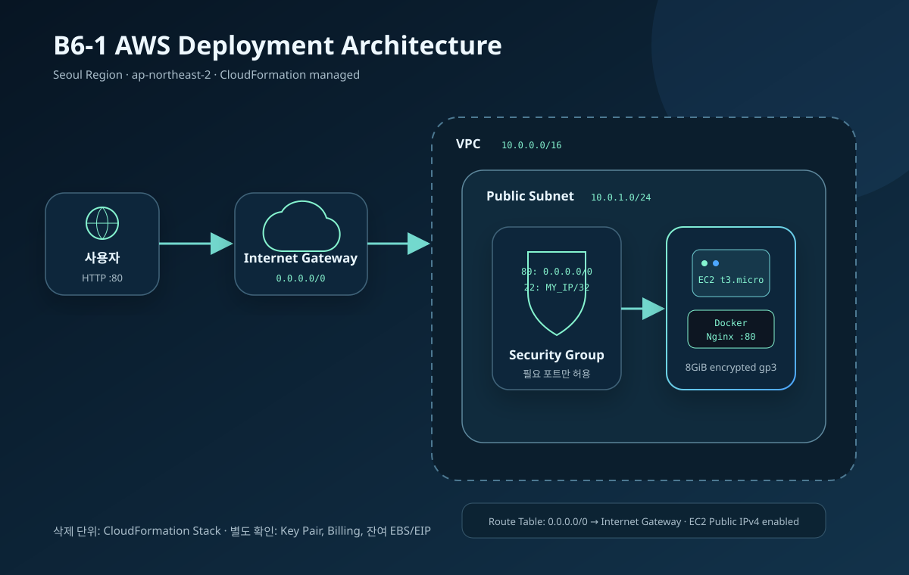

# B6-1: 내가 만든 웹사이트를 인터넷에 올려 누구나 쓰게 하기

> **2026-09-24 권한 변경:** 기존의 서울 전체 EC2 변경 정책은 사용하지 않는다. [배포 권한 경계](docs/deployment-permissions.md)를 먼저 확인하고, 두 정책을 검증·적용한 뒤 진행한다. AWS 적용·실제 배포 검증 전에는 완료로 표시하지 않는다.


<!-- codyssey-links:end -->

AWS 서울 리전의 VPC와 EC2에 **Docker Nginx 정적 사이트**를 배포하는 학습 프로젝트다. CloudFormation으로 인프라를 다시 만들 수 있고, 브라우저와 `/health` 응답으로 실제 동작을 검증한다.

> **현재 상태:** 2026-10-03 19:17 KST IAM으로 실습 리소스 정리 완료. 스택 DELETE_COMPLETE, EC2 terminated, EBS·키페어·시작 템플릿·해당 네트워크 삭제 확인. 서울 EIP/NAT/ALB/RDS/스냅샷0개. 최종 IAM Billing 조회 완료. [평가 항목별 설명·증거 안내](docs/evaluation-evidence-guide-2026-10-03.md).

실행 당시 배포 URL(현재 EC2 종료): [http://52.79.115.167](http://52.79.115.167) · [health](http://52.79.115.167/health)

최신 [IAM 증거 재수집·검수 결과](docs/evidence-review-ready-2026-10-03.md): 2026-10-03 18:25~18:27 KST, IAM Billing 홈 월간 USD 0.00·잔여 크레딧 USD 119.97 확인. 18:42 KST 세부 청구서와 청구 문서도 IAM 조회 성공(예상 USD 0.00, 상세 데이터 없음, 문서 0건). 금액 갱신 지연 및 준비 단계 root 이력을 기록했다. 18:56 KST 승인 후 삭제를 시작하고 권한 보정 후19:17 KST IAM 정리 완료(43~47).

실제 서버 코드: `6bc1076c4311cc2685b483ca326be8bc7e5f4bb1`(첫 배포 기록 전 커밋). 원격 main은 변경하지 않았다. [새 증거 목록](evidence/README.md), [IAM 실행 기록](docs/iam-execution-2026-10-03.md), [재배포 기록](docs/redeployment-2026-10-03.md)에 결과와 준비 단계의 관리자 사용을 구분해 기록했다.

## 과제 정보

| 항목 | 내용 |
|---|---|
| 분야 | AI/SW 기초 |
| 구분 | 클라우드와 AI API |
| 공식 학습 시간 | 40시간 |
| 필수 여부 | 필수 |
| 과제 번호 | 185015 |
| 리전 | 서울 `ap-northeast-2` |
| 웹 서버 | Docker + Nginx |
| 인프라 | AWS CloudFormation |

## 구현 상태

| 요구사항 | 구현 | 실제 AWS 검증 |
|---|---:|---:|
| 정적 웹사이트 | 완료 | 외부 브라우저 확인 |
| `GET /health` → 200 `OK` | 완료 | 외부 HTTP 200 |
| Dockerfile과 container healthcheck | 완료 | EC2 healthy |
| VPC `10.0.0.0/16` | CloudFormation 완료 | 실제 확인 |
| Public Subnet `10.0.1.0/24` | CloudFormation 완료 | 실제 확인 |
| Internet Gateway와 기본 Route | CloudFormation 완료 | active |
| EC2 t3.micro, 8GiB 암호화 gp3 | CloudFormation 완료 | running / in-use |
| HTTP 80 전체 공개 | CloudFormation 완료 | 실제 규칙 확인 |
| SSH 22 개인 IP `/32` | CloudFormation 완료 | SSH 연결 성공 |
| SSH `0.0.0.0/0` 거부 | CloudFormation Rule 완료 | 전체 인바운드 규칙 확인 |
| IAM 최소권한 정책 | 제한 정책 및 두 인라인 보정 | IAM 실제 스택 배포 |
| 아키텍처 다이어그램 | 완료 | 해당 없음 |
| 트러블슈팅 기록 | 개발환경 및 AWS IAM 2건 | 실패와 수정 후 성공 기록 |
| 리소스 정리 체크리스트 | 완료 | 별도 요청 전 보존 |
| HTTPS 보너스 | 도메인 없음 | 후속 작업 |

## 아키텍처



제출용 파일: [docs/architecture.pdf](docs/architecture.pdf) (과제 최소 규격)

요청 흐름:

```text
사용자
 → Internet Gateway
 → Public Subnet Route Table
 → Security Group (HTTP 80)
 → EC2 Public IPv4
 → Docker container
 → Nginx
 → index.html 또는 /health
```

CloudFormation 리소스:

- VPC 1개
- Public Subnet 1개
- Internet Gateway 1개
- Route Table과 `0.0.0.0/0` Route
- Security Group 1개
- EC2 1대
- EC2 종료 시 함께 삭제되는 암호화 EBS 8GiB

Elastic IP, NAT Gateway, Load Balancer, RDS는 만들지 않는다.

## 저장소 구조

```text
.
├── Dockerfile
├── nginx/default.conf
├── site/
│   ├── index.html
│   ├── styles.css
│   └── app.js
├── infra/
│   ├── cloudformation.yml
│   └── deployer-policy.json
├── scripts/
│   ├── test-local.sh
│   ├── deploy-stack.sh
│   ├── delete-stack.sh
│   ├── scan-secrets.sh
│   ├── aws-verify.sh
│   └── validate_project.py
├── docs/
│   ├── architecture.svg
│   ├── architecture.pdf
│   ├── account-setup.md
│   ├── deployment-guide.md
│   ├── troubleshooting.md
│   ├── cleanup-checklist.md
│   └── https-plan.md
└── evidence/
    └── README.md
```

## 1. 로컬 Docker 실행

필요한 것:

- Docker Desktop 또는 Docker Engine
- `curl`

```bash
scripts/test-local.sh
```

직접 실행하려면:

```bash
docker build -t b6-1-web .
docker run --rm -p 8080:80 --name b6-1-web b6-1-web
```

다른 터미널:

```bash
curl -i http://localhost:8080/health
```

기대 결과:

```text
HTTP/1.1 200 OK

OK
```

## 2. AWS 배포 순서

기존 AWS 계정은 사용할 수 있지만 보안·비용 준비 상태는 아직 확인하지 않았다. 계정 소유자가 Console에서 다음 단계를 순서대로 수행한다.

1. [`docs/account-setup.md`](docs/account-setup.md): 계정, MFA, IAM, 예산, Key Pair
2. [`docs/deployment-guide.md`](docs/deployment-guide.md): CloudFormation 생성과 검증
3. [`evidence/README.md`](evidence/README.md): 실제 증거 수집
4. [`docs/cleanup-checklist.md`](docs/cleanup-checklist.md): Stack 삭제와 Billing 확인

CloudFormation 콘솔에서 사용할 파일:

```text
infra/cloudformation.yml
```

이번 실행은 Console에서 Stack을 만들고, 같은 로그인 세션의 AWS CloudShell에서 검증한다.

```bash
git clone https://github.com/giyeop-cody/B6-1.git
cd B6-1
scripts/aws-verify.sh b6-1-learning
```

장기 Access Key를 만들거나 파일에 저장하지 않는다. CLI 생성·삭제를 선택할 경우에만 `scripts/deploy-stack.sh`와 `scripts/delete-stack.sh`를 사용하며 두 스크립트는 확인 단어를 요구한다.

## 3. 보안 선택

- 루트 계정은 최초 IAM 준비 외에 사용하지 않는다.
- AdministratorAccess를 사용하지 않는다.
- `infra/deployer-policy.json`은 필요한 CloudFormation·EC2·SSM·CloudShell Action과 서울 리전으로 범위를 줄인다.
- CloudShell 파일 upload/download 권한은 주지 않는다.
- HTTP 80만 전체 인터넷에 공개한다.
- SSH 22는 사용자가 입력한 개인 공인 IP `/32`만 허용한다.
- EC2 Metadata는 IMDSv2를 필수로 한다.
- EBS는 암호화하고 EC2 종료 시 삭제한다.
- `.pem`, `.key`, `.env`, `.aws/`는 Git에서 제외한다.
- `scripts/scan-secrets.sh`로 기본 비밀정보 패턴을 검사한다.

## 4. 비용 관리

2025년 7월 15일 이후 신규 계정의 AWS Free Tier는 예전 신규 계정 설명과 다를 수 있다. 2026년 가입자는 계정에서 Free Plan, 크레딧, 6개월 제한, 서비스별 사용 가능 여부를 직접 확인한다.

- https://aws.amazon.com/free/free-tier-faqs/
- https://docs.aws.amazon.com/AWSEC2/latest/UserGuide/ec2-free-tier-usage.html

이번 실행 전 무료 플랜 잔여 크레딧 USD 119.97 및 10월 누계 USD 0.00을 화면에서 확인했다. 배포 후 확정 청구액은 확인하지 않았다. t3.micro 1대, standard CPU credits, 암호화 gp3 8GiB를 사용하며 별도 EIP/NAT/ALB/RDS는 만들지 않았다. Budget은 미생성이다. 증거 누락 확인 후 사용자의 별도 삭제 요청이 있을 때만 정리 및 Billing 확인을 진행한다.

## 5. 보너스 범위

### Docker

구현됨:

- Nginx Docker image
- 포트 `80:80`
- Docker healthcheck
- EC2 재부팅 후 자동 시작을 위한 `--restart unless-stopped`

실제 EC2의 `docker ps`, healthy, 내부 HTTP 200 및 고정 커밋은 [SSH 원본 출력](evidence/2026-10-03/13-ssh-docker-healthy.txt)에서 확인할 수 있다.

### HTTPS

현재 사용할 도메인이 없으므로 미구현이다. 거짓 인증서나 localhost 결과로 완료 처리하지 않는다. 후속 계획은 [`docs/https-plan.md`](docs/https-plan.md)에 기록했다.

## 6. 학습과 문제 기록

- [`LEARNING.md`](LEARNING.md): 용어와 단계별 학습
- [`docs/decisions/001-deployment-approach.md`](docs/decisions/001-deployment-approach.md): 배포 방식 선택
- [`docs/decisions/002-console-cloudshell-auth.md`](docs/decisions/002-console-cloudshell-auth.md): 비밀 키 없는 인증·검증 방식 선택
- [`docs/mentoring/session-001.md`](docs/mentoring/session-001.md): 학습 멘토 토론
- [`docs/development-log.md`](docs/development-log.md): 순차 구현 기록
- [`docs/issues/`](docs/issues/): 문제와 차단사항
- [`docs/troubleshooting.md`](docs/troubleshooting.md): 재현·가설·검증·조치

## 제출 전 완료 조건

- [x] IAM 실제 배포 사용자 확인(관리자 준비 단계는 별도 기록)
- [x] CloudFormation `UPDATE_COMPLETE`
- [x] 배포 URL에서 사이트 표시
- [x] 외부 `/health` 200
- [x] EC2 내부 Docker `healthy` 및 실제 커밋 확인
- [x] 실제 AWS 트러블슈팅 기록
- [x] 이번 배포 증거 파일 존재·내용 대조
- [x] MFA 확인
- [x] Stack과 별도 리소스 삭제
- [x] 삭제 후 Billing 확인(46·47, 예상 금액이며 최종 청구 미확정)

이 체크가 끝나기 전까지 Codyssey 제출 상태를 “완료”라고 기록하지 않는다.
