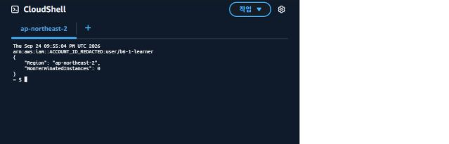

# IAM 사용자 콘솔 사용 증거 보완

- 확인 시각: 2026-09-25 06:55:04 KST (AWS CloudShell 출력: 2026-09-24 21:55:04 UTC)
- 콘솔 사용자 메뉴: `IAM 사용자`, `b6-1-learner`
- `aws sts get-caller-identity --query Arn --output text` 결과: `arn:aws:iam::ACCOUNT_ID_REDACTED:user/b6-1-learner`
- 조회 리전: 서울 `ap-northeast-2`
- 비종료 EC2 수: `0` (pending/running/stopping/stopped/shutting-down)



## 확인 범위

별도로 생성한 IAM 사용자 `b6-1-learner`로 콘솔과 CloudShell에 접근하고 EC2 조회를 수행했다. 사용자 ARN과 서울 리전의 비종료 EC2 0개를 실제 출력으로 확인했다. 과거 배포 이벤트에 대한 추가 조회 결과는 [최종 점검](final-audit-2026-09-25.md)에 기록한다.

## 공개용 처리

원본 콘솔 화면과 ARN 출력은 로컬에 별도 보존했다. 공개용 화면은 AWS 명령의 ARN 출력에서 계정 번호만 sed로 가리고, 계정 이름·번호가 있는 상단 탐색 영역을 제외해 캡처했다. IAM 사용자명, 리전, 조회 결과와 시간은 유지했다. 새 리소스 생성이나 권한 변경은 하지 않았다.

## 실제 조회 명령

```bash
date -u
aws sts get-caller-identity --query Arn --output text --no-cli-pager | sed -E 's/[0-9]{12}/ACCOUNT_ID_REDACTED/g'
aws ec2 describe-instances --region ap-northeast-2 --filters Name=instance-state-name,Values=pending,running,stopping,stopped,shutting-down --query '{Region: `ap-northeast-2`, NonTerminatedInstances: length(Reservations[].Instances[])}' --output json --no-cli-pager
```

Billing 최종 집계는 별도 확인 사항이며 이번 IAM 로그인 증거에 포함하지 않는다.
